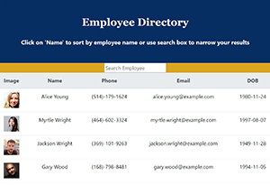

## Project Name: Employee Directory

 

## Table of Contents

<!-- vscode-markdown-toc -->
* 1. [Links to deployed application and repository](#Linkstodeployedapplicationandrepository)
* 2. [Introduction](#Introduction)
* 3. [Technologies](#Technologies)
* 4. [Features:](#Features)
* 5. [Launch](#Launch)

<!-- vscode-markdown-toc-config
	numbering=true
	autoSave=true
	/vscode-markdown-toc-config -->
<!-- /vscode-markdown-toc -->

##  1. Links to deployed application and repository
* [Deployed Application](https://sskumar4.github.io/view_employee_directory/)
* [Repository](https://github.com/sskumar4/view_employee_directory)

##  2. Introduction   
An employee directory application using React. This application separates UI into components, component state, and respond to user events.

##  3. Technologies 
HTML, CSS, JSX, React, Random user API, boors api

##  5. Features
 * When the user loads the page, a table of random users is displayed, aong with image, name, date of birth, and email. 

The user can

  * Sort the table by Name

  * Filter the users using search box by name.
  

##  6. Launch

Launch [Deployed Application](https://mysterious-oasis-01338.herokuapp.com/) to view the index. 

## view_employee_directory
This project was bootstrapped with [Create React App](https://github.com/facebook/create-react-app).

## Available Scripts

In the project directory, you can run:

### `npm start`

Runs the app in the development mode. 
Open [http://localhost:3000](http://localhost:3000) to view it in the browser.

The page will reload if you make edits. 
You will also see any lint errors in the console.

### `npm test`

Launches the test runner in the interactive watch mode. 
See the section about [running tests](https://facebook.github.io/create-react-app/docs/running-tests) for more information.

### `npm run build`

Builds the app for production to the `build` folder. 
It correctly bundles React in production mode and optimizes the build for the best performance.

The build is minified and the filenames include the hashes. 
Your app is ready to be deployed!

See the section about [deployment](https://facebook.github.io/create-react-app/docs/deployment) for more information.

